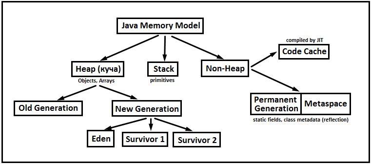
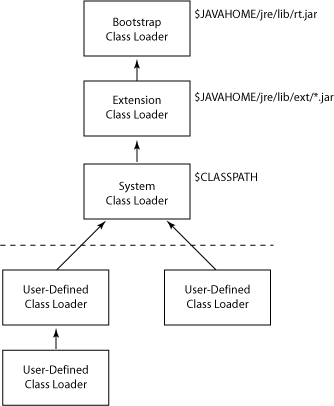
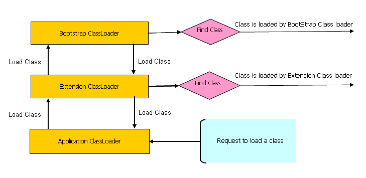
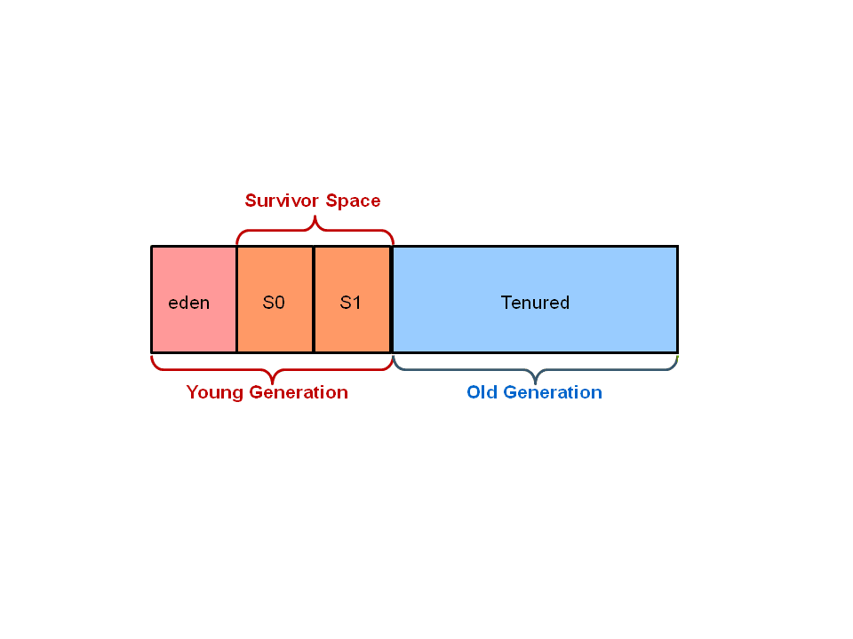
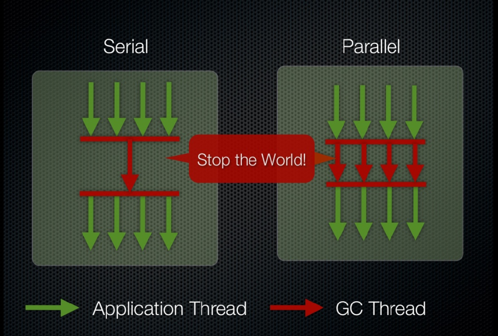

Создать класс Article со следующими полями: 
- title - название статьи
- text - текст статьи
- dateCreated - дата и время написания статьи (текущие дата и время должны устанавливаться во время создания объекта)
- значение title инициализируется при создании объекта
- text задаётся через сеттер

[Article.java](enums/Article.java)

создали enum Country
вернулись в Article и добавили страну.

создали пару объектов Article

переопределили метод toString в Article

посмотрели как энум выводится в консоль

посмотрели методы энама

## Модель памяти Java

Куча - общее хранилище данных под объекты
Там хранятся все созданные объекты.
Сборщик мусора находит там объекты, на которые уже нет ссылок (они не нужны).
Если выделенной памяти для кучи будет недостаточно - при создании объекта будет эксепшен.

Нужно: Выделать достаточно количество памяти; следить за утечками памяти.

Стек - память, которая выделяется для вызова методов, ссылок и примитивов.
При вызове метода - он складывается на вершину стека.
Если метод бесконечно рекурсивно выделяется - будет переполнение памяти стека - тоже эксепшен.

PermGen и Metaspace - это одна и та же область. В зависимости от версии Java.
PermGen - до Java 8; Metaspace - начиная с Java 8. Metaspace отличается только тем, что может динамически расширяться.
Здесь хранится все описания классов, методов и вся статика.
Начиная с Java 7 хранится пул строк.

Значения размеров памяти по умолчанию - определяются реализацией JVM.
Для каждой области памяти, выделенные значения 

### Загрузка классов

Классы загружаются по мере необходимости: когда нужно создать объект этого класса или его потомка. Или использовать 
статику из него.
За загрузку классов используются загрузчики классов. Их несколько. Некоторыми из них можно управлять, на остальные 
никак нельзя повлиять. 

Bootstrap - базовый загрузчик. Отвечает за загрузку основных системных классов. К нему нет доступа.

ExtensionClassLoader - загрузчик расширений. Дочерний загрузчик от Bootstrap-а. Он загружает классы дополнительных 
библиотеки, которые используются в программе.

SystemClassLoader - Отвечает за загрузку классов приложений (созданных нами).
На его основе можно создавать собственные загрузчики классов.
Собственные загрузчики классов - всегда будут наследоваться от System Class Loader.

#### Процесс загрузки классов

У каждого загрузчика есть свой кэш классов, которые он уже загружал: когда загрузчик загружает класс - он кладёт его в 
свой кэш.
Загрузчики передают друг другу запросы на загрузку классов.
Исходный запрос идёт в SystemClassLoader
Он смотрит в свой кеш: если не найден - он перенаправляет запрос родителю: ExtensionClassLoader
Родитель тоже ищет класс у себя в кэше: если не найден - передаёт запрос родителю: Bootstrap
Если Bootstrap не нашёл у себя в кэше - передаёт обратно ребёнку (Extension) и уже тот ищет способы загрузить класс. 

##### Запуск приложения с опциями
В *IDEA* в конфигурации запуска проекта можно задать настройки
Или в верхнем меню. Run -> EditConfigurations

В пункте VM options указываются опции запуска JVM:
размер памяти, логирование и мн. др.
опций очень много - искать в документации.
некоторые опции поддерживаются не всеми версиями java
например опция `-verbose:class` приведёт к тому, что в консоль будут выводиться все загружаемые классы.

Видим, что часть классов загружаются при загрузке приложения; остальные - по мере необходимости.

### Работа стека вызовов
смотрим на классы Message и TstMessage

При запуске приложения запускается метод main: он добавляется в стек вызовов
В пуле строк создаётся "Срочное сообщение"
Ссылка на него `data` - создаётся в стеке
примитив `num` - создаётся в стеке

Происходит вызов метода printStart() - на вершину стека добавляется метод printStart() - создаётся блок под него.
В пуле строк создаётся объект "START"
Вызывается метод `println()` - он добавляется на вершину стека

метод println отработал - удалён из стека (память стека высвобождается)
`printStart()` закончил работу - удалён из стека, память высвобождается

далее по методу `main`
создаётся объект Message - он создаётся в куче
а ссылка на него message - в стеке 

далее вызывается метод setText - добавляется в стек - отрабатывает - удаляется из стека
далее вызывается метод setCode - добавляется в стек - отрабатывает - удаляется из стека
main закончил работу - удаляется из стека.

на 13й строке произошло обращение к конктрутору Message
Когда класс Message прогружался - в метаданные прогрузилось описание класса + вся его статика.

    Message message = new Message();
    message = new Message();
    message = null;

Объекты из кучи не удаляются.
Присвоение ссылочной переменной null - это не удаление объекта, это удаление ссылки на него. Объект при этом в куче 
остаётся до тех пор пока его из кучи не удалит сборщик мусора.

### Сборка мусора
Сборка мусора происходит автоматически. На неё повлиять нельзя.
Сборщики мусора отличаются от реализации JVM.
Можно выбрать сборщик мусора (если JVM позволяет)
Можно настроить сборщик мусора (если JVM позволяет)

Все решения по сборке мусора выполняет сама машина.
Заставить его уничтожать объекты нельзя.

Сборщики мусора делят кучу по разному.
Но все выделяют: молодое поколение (eden) - новые объекты
Выжившие (tenured) - долгоживущие объекты
И что-то промежуточное.

Изначально объекты создаются в молодом поколении.
Если объекты достаточно большие, они могут быть перемещены в старое поколение.

Сборщики мусора чаще всего работают в молодом поколении.
Там они ищут объекты, которые нужно уничтожить, и объекты, которые уничтожать не надо.

Объекты, которые не подлежат уничтожению, сборщик переносит в промежуточный блок (область выживших, выживших после 
первой сборки)

Второй раз сборщик работает уже в первых двух блоках (новое поколение, первое промежуточное)
Лишние уничтожены, выжившие перенесены в блок следующих выживших

И так далее.
Объекты, выжившие достаточно долго перемещаются в Old Generation

Самый старый и самый простой сборщик мусора - последовательный.
И похожий на него - параллельный.
Последовательный работают в один поток; параллельный - в несколько потоков.

Они оба **останавливают приложение** (Stop the world!), анализируют объекты, выбрасывают мусор, перемещают объекты.  
И только когда закончат работу - возобновляют работу программы.  
Параллельный, конечно, быстрее.  
Для него можно указать количество потоков.

Garbage first (сборщик по умолчанию с java 8)
Garbage first параллельный (сборщик по умолчанию с java 9)
Оба ориентированы на минимальную приостановку программы.
Часть своей работы они выполняют параллельно с работой приложения: 
- они занимаются анализом объектов, которые необходимо будет удалить, собирают статистику.
- приложение останавливается. ещё раз происходит повторный анализ, удаление мусора
- приложение возобновляется.

Оба делят кучу на **несколько** молодых поколений, выживших, старших поколений.
Деление на сегменты происходит постоянно. И перемещение объектов между сегментами тоже происходит постоянно.

### Опции сборщика мусора
