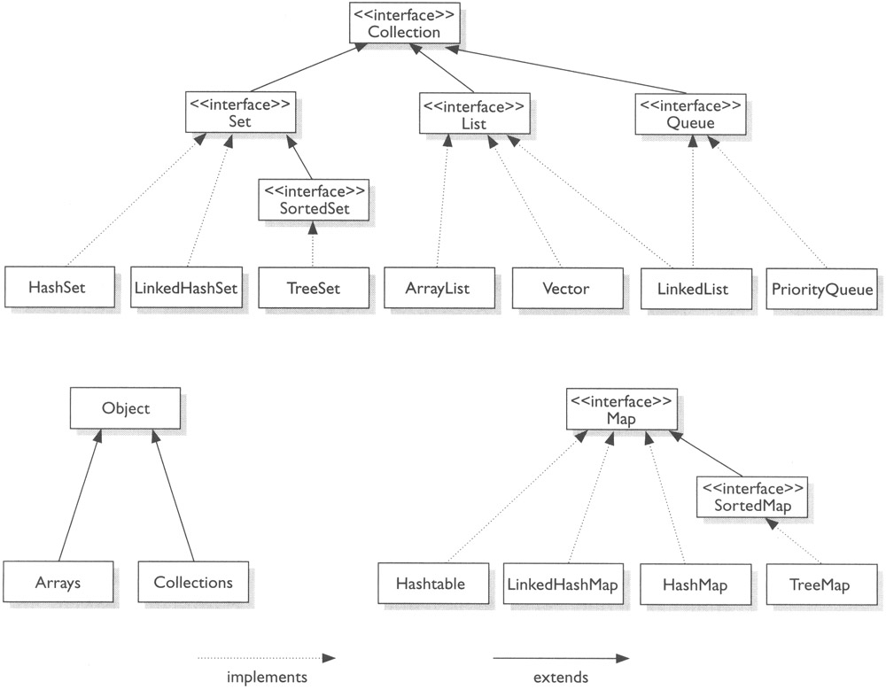

## Коллекции

[Student.java](Student.java)

есть класс Student, у него есть имя, фамилия, возраст, конструктор, геттеры-сеттеры.

До сих пор для хранения данных мы использовали массивы.
Массивы это всегда хороший выбор: они быстрее, эффективнее, экономнее, просто реализованы.

Коллекции - это более гибкий и удобный способ хранения данных. Но коллекции требуют дополнительных расходов. 

Коллекции - это контейнер для хранения данных. Любая коллекция это всегда контейнер гибкого объёма: от 0 до 
неограниченного количества элементов. В любой коллекции можно:
- добавить элемент(ы): сложить их в контейнер;
- получить / прочитать элементы;
- перебрать коллекцию;
- заменить элемент коллекции;
- удалить элемент из коллекции.

Коллекции 

### Иерархия коллекций

Все коллекции наследуются от интерфейса Collection: он содержит методы, которые должны реализовывать все коллекции.
Все коллекции подразделяются на Set, List, Queue - это тоже интерфейсы, наследники Collection.
Ниже на картинке представлены конкретные классы коллекций, реализующие соответствующие интерфейсы.

Maps коллекциями не являются, они не наследуются от Collection, но при этом мапы обладают схожими методами 
добавления-удаления элемента в коллекции.

В Java существуют несколько готовых реализаций коллекций (все они реализуют интерфейсы Collection). Между собой они 
различаются:
- безопасностью использования в многопоточных средах: 
    - сегодня все рассмотренные коллекции **не** потокобезопасны. их нужно использовать только в однопоточных средах;
    - коллекции для многопоточных сред будут рассмотрены в теме многопоточности.
- возможностью хранить дублирующиеся элементы: дубликат (дублирующийся элемент) - это который равен имеющемуся через 
    использование метода (equals)  
- возможностью хранить элементы в отсортированном виде: причём сортировку можно задавать самостоятельно
- скоростью работы: добавления, удаления, извлечения элементов в начале / середине / конце коллекции
- возможностью хранить элементы в том порядке, в котором они были добавлены
- возможностью обращения к произвольному элементу в коллекции (по индексу, например, как в массиве).
- и т.д. 

Все коллекции -- дженерики. Все коллекции позволяют указывать тип данных, который будет храниться в коллекции.

### Linked List 

На практике вместо него чаще всего используется Array List.

Структура Linked List:
- состоит из узлов
- знает о своём первом элементе
- знает о своём последнем элементе
- каждый узел
    - хранит значение элемента (то ради чего коллекция создаётся)
    - хранит ссылку на предыдущий элемент (если его нет, то null)
    - хранит ссылку на следующий элемент (если его нет, то null)
    - то есть Linked List в Java -- двунаправленный

Особенности Linked List:
- порядок хранения элементов соответствует порядку добавления -- новые элементы по умолчанию добавляются в конец списка
- позволяет хранить null-ы
- допускает хранение дубликатов
- допускает добавление, доступ и удаление элементов по индексу. индексация начинается с нуля.

[CollectionsDemo.java](CollectionsDemo.java)

### Array List

ArrayList - очень часто используемая коллекция. ArrayList - это динамически расширяемый массив.

Структура ArrayList:
- Внутри ArrayList лежит массив, и все элементы ArrayList лежат внутри этого массива.
- При необходимости ArrayList умеет автоматически расширять свой массив (пересоздавать его на больший, с копированием 
    элементов)
- По требованию (не автоматически) ArrayList умеет сокращать свой массив до размера хранимой коллекции.

Особенности ArrayList:
- Реализован на основе массива
- порядок хранения элементов соответствует порядку добавления -- новые элементы по умолчанию добавляются в конец списка
- позволяет хранить null
- допускает хранение дубликатов
- допускает добавление, доступ и удаление элементов по индексу. Индексация начинается с нуля.

Способности ArrayList похожи на LinkedList, но они отличаются реализацией: в LinkedList внутри работают ссылки; 
ArrayList хранит массив и работает с этим массивом (при необходимости пересоздаёт его на меньший / больший). 

### Интерфейс Set

Особенности интерфейса Set: 
- Все множества используются для хранения **уникальных** элементов: Set не допускает хранения дублирующихся элементов.
- В хранимом типе данных должны быть переопределены методы `equals()` и `hashCode()`;
- В Set не реализован метод `get`: нельзя получить элемент множества, можно только проверить, есть ли в множестве такой 
    элемент или нет
- В Set нет работы с индексами: нельзя положить элемент на конкретную позицию.

(переопределили `equals()` и `hashCode()` в `Student`). 

### HashSet

Особенности HashSet:
- основан на hash-таблице, использует метод `hashCode()` хранимых объектов.
- порядок хранения может отличаться от порядка добавления:
    - элементы с м*е*ньшим хэш-кодом располагаются раньше чем элементы с б*о*льшим хэш-кодом;
- может хранить null (он всегда будет расположен на первом месте). 

### LinkedHashSet

Аналогичен HashSet, но дополнительно хранит порядок элементов.
Уступает в скорости работы HashSet. 
Но сохраняет порядок добавления элементов: элементы хранятся в том же порядке, в каком были добавлены.

### TreeSet

Хранит уникальные элементы в отсортированном виде

Особенности TreeSet:
- нельзя добавить null (при попытке будет exception)
- элементы хранятся в отсортированном виде
- основан на алгоритме красно-чёрного (бинарного) дерева 

Для добавления элементов в `TreeSet` необходимо явно указать принцип сортировки. Для этого необходимо:
1. чтобы класс, экземпляры которого будут храниться в коллекции, реализовывал интерфейс `Comparable` - и его метод 
    `compareTo()`, в котором реализован принцип сравнения объектов.
2. реализовать компаратор (класс `Comparator`), способный сравнивать объекты, которые будут храниться в коллекции, и 
    передать этот компаратор в конструктор `TreeSet`.  
    
Идём в класс `Student` реализовывать `Comparable` интерфейс.
Интерфейс `Comparable` дженерик, нужно указать тип данных, который будет сравниваться.